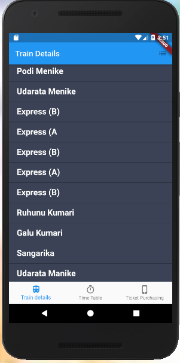
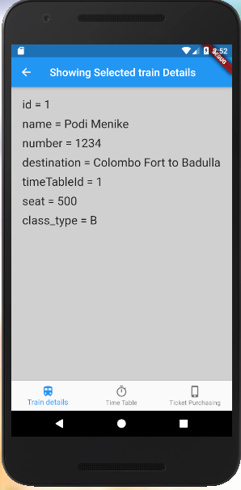
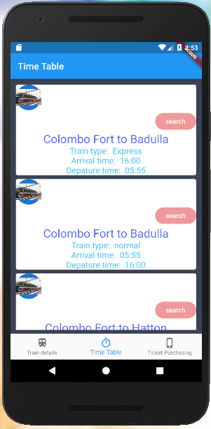
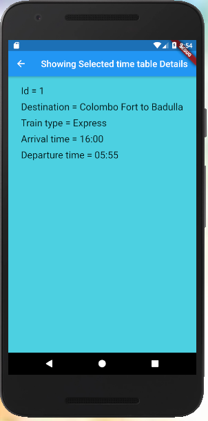
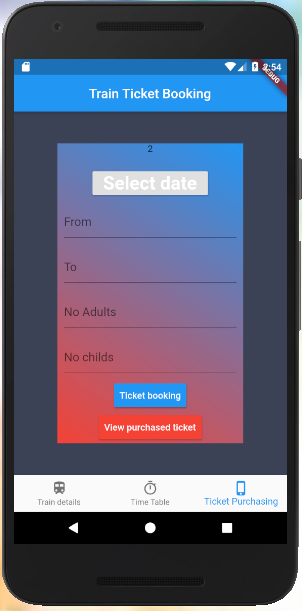
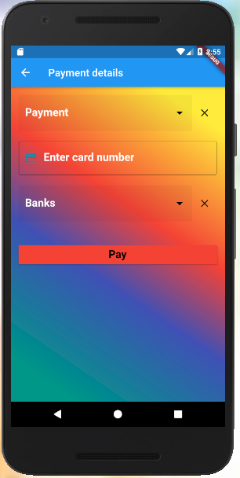
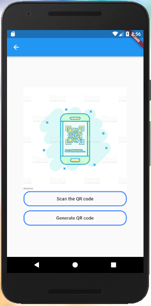
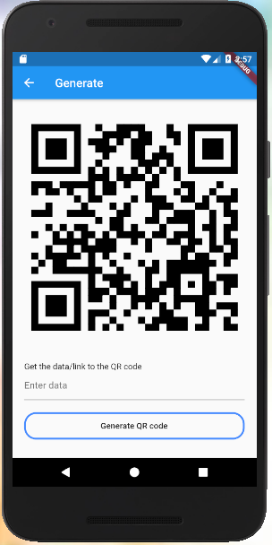

# Mobile-application-for-final-project

Technical details

1. Technology:- Flutter framework
2. Programming language:- Dart
3. Database:- MySQL
4. IDE:- Android Studio

| Tables        | Are           | Cool  |
| ------------- |:-------------:| -----:|
|  |  |  |
|  |  | |
|  |  |  |
| |

	
Login Page	Home page	

	

This is train details page and train details display as a list view.        After clicking items in the list view this will display

	

This is the time table details page and time table                   After click item in the time table page, each Display as a card.                                                                           Record display in this page.

       
       
       
       
       
       	

This is the train ticket booking page                                         This is a payment details page

	

This is a QR code generator page
